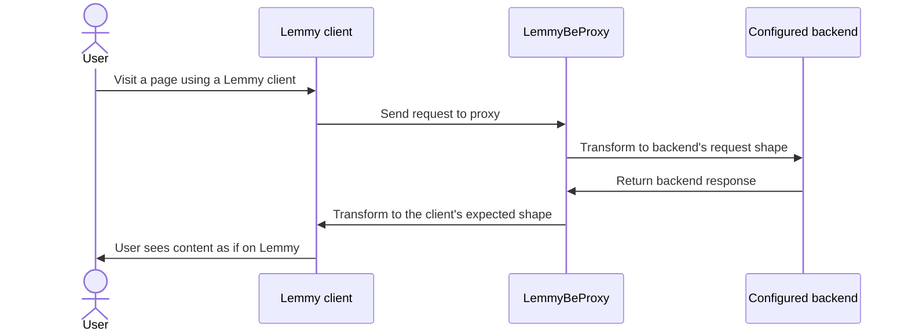

# LemmyBeProxy

A simple proxy that acts as a compatibility layer for Lemmy apps against Piefed and newer versions of Lemmy.

It sits in front of a configurable backend and speaks Lemmy's API to
whatever's talking to it, regardless of what's actually behind it or how
old the client is. Any Lemmy-compatible app or frontend (mlmym,
Alexandrite, Voyager, official Lemmy apps, lemmyBB, and so on) can talk
to this proxy without knowing or caring what it's really connected to.

The goal is a genuine compatibility layer across Lemmy API generations —
not just Piefed vs. real Lemmy, but old clients against new backends and
vice versa, so nothing breaks outright just because either side moved
forward. That work is ongoing; see Features below for exactly where it
currently stands.

## How it works



The proxy exposes Lemmy's API at `/api/v3/*` and image uploads at
`/pictrs/image`, the same paths a real Lemmy server uses. Internally,
`BACKEND_TYPE` picks what it talks to and `FRONTEND_VERSION` picks the
wire format it accepts from and replies to clients with — the two are
independent, and neither takes a default. Against a real Lemmy backend
on the current wire format, translation is close to a no-op, since this
proxy's internal shapes are already modeled on Lemmy's own API.

## Quick start

```
docker build -t lemmybeproxy .

docker run -d \
  --name lemmybeproxy \
  --restart unless-stopped \
  -p 127.0.0.1:8050:8080 \
  -e BACKEND_TYPE=piefed \
  -e BACKEND_INSTANCE=your-instance.example \
  -e FRONTEND_VERSION=0.19 \
  lemmybeproxy
```

`BACKEND_TYPE` is `piefed` or `lemmy`; `BACKEND_INSTANCE` is that
backend's hostname, no scheme, no path. `FRONTEND_VERSION` is `0.19`
(current Lemmy wire format) or `0.17` (older format, e.g. lemmyBB). All
three are required — see Environment variables for the full list.

Point a reverse proxy's `/api/v3/*` and `/pictrs/image*` routes at this
container, and everything else at your actual frontend (e.g. mlmym).
Nginx and Caddy examples, plus the full walkthrough including automatic
updates via Watchtower, are in [DEPLOYMENT.md](DEPLOYMENT.md).

Verify it's working:

```
curl -s "https://your-domain.example/api/v3/site" | head -c 200
```

## Features

**Backends** — what this proxy can translate *to*:
- Piefed, via `/api/alpha/*`
- Real Lemmy, close to a passthrough since the shapes already match

**Frontend / wire compatibility** — what this proxy can accept *from* clients:
- Lemmy 0.19.x (current) — full coverage
- Lemmy 0.18.x authentication convention (`auth` in the request body or
  query string instead of an `Authorization` header) — applied centrally
  to every route, not endpoint-specific
- Lemmy 0.17.x wire format (e.g. lemmyBB) — Post, Comment, Community,
  User, Search, and Site endpoints, all verified against Lemmy's real
  0.17.2 source. `pictrs/image` needs no version-specific handling at
  all and works as-is — confirmed directly against lemmyBB's own upload
  code, which uses the identical field name and response shape. That's
  full 0.17.x coverage of every endpoint this proxy implements.

**Endpoints implemented and tested against a live Piefed instance:**
`user/login`, `user/unread_count`, `user`, `user/block`,
`user/save_user_settings` (Piefed only supports a subset of fields — see
Features not working yet), `site`, `post/list`, `post` (get/create/edit),
`post/like`, `post/mark_as_read`, `comment/list`, `comment`
(get/create), `comment/like`, `community`, `community/list`,
`community/follow`, `community/block`, `search`, `pictrs/image` (upload
and fetch, outside `/api/v3` since that's where real clients send them).

## Features not working yet

**Backend pluggability covers Post, Comment, and Community.** User,
Search, Site, and Upload controllers still talk to a Piefed-shaped
client directly regardless of `BACKEND_TYPE` — not migrated yet.

**Frontend pluggability (0.17.x wire format) is done — every endpoint
this proxy implements works on both wire formats.** User, Search, and
Site are on the Frontend axis but not the Backend one yet; Upload
doesn't need Frontend-axis work at all, since `pictrs/image` is
version-agnostic by nature.

**Not implemented in Piefed itself**, confirmed from Piefed's own source
— not a translation gap, there's nothing on Piefed's side to translate
to: registration, report count, password reset/change, TOTP, account
deletion, email verification, admin tools, custom emoji.

**Known limitations:**
- Image thumbnails always load at full resolution — Piefed ignores the
  `?format=jpg&thumbnail=96`-style query params real pict-rs understands.
- `save_user_settings` silently drops fields Piefed has no equivalent
  for (most notably mlmym's "endless scrolling," which can never persist
  server-side against Piefed) rather than failing the whole save.
- 0.17.x `mark_as_read` returns the canonical `{success: bool}` shape
  instead of real 0.17.x's `PostResponse{post_view}` — building the
  latter needs an extra backend round-trip, deferred rather than rushed.
- 0.17.x comment responses don't echo back a client's `form_id` (used
  for optimistic-UI correlation) — accepted on requests, not threaded
  through to responses yet.

## Environment variables

| Variable | Required | Description |
|---|---|---|
| `BACKEND_TYPE` | Yes | `piefed` or `lemmy`. No default. |
| `BACKEND_INSTANCE` | Yes | Hostname of the backend. No scheme, no trailing slash. |
| `FRONTEND_VERSION` | Yes | `0.19` or `0.17`. No default. |
| `PORT` | No | Port to listen on. Defaults to `8080`. |
| `SIMULATE` | No | If set, the proxy presents itself as a Lemmy server when asked for version/software info. |

mlmym (or whatever frontend you run alongside this) has its own env
vars, including `LEMMY_DOMAIN`, `COLLAPSE_MEDIA`, `HIDE_THUMBNAILS` — see
that project's own documentation.

## Troubleshooting

**Parse error mentioning an invalid character around byte `0x1f`** — a
gzip-compressed response got handed to the JSON parser undecompressed.
Caused by forwarding a client's own `Accept-Encoding` header onto the
outbound request, which disables Go's automatic gzip handling. This
project already strips that header before forwarding; keep that in mind
if you add new outbound requests elsewhere.

**Frontend is slow on every page load**, despite the API responding
fast when tested directly — the frontend container is likely reaching
its own API calls by round-tripping out to the public internet instead
of staying local. Fixed with `--add-host yourdomain.com:host-gateway`
on the frontend container — see DEPLOYMENT.md.

**A specific sort or listing combination fails or is unusually slow** —
Piefed validates sort values per endpoint, and the valid set differs
between them (community listing accepts fewer values than post
listing, for example). Check Piefed's own error message for what's
actually valid on that specific endpoint.

**Build fails with a `slices` package / GOROOT error** — an old Go
toolchain is active, usually one installed via a distro package manager
instead of the official binary. Needs Go 1.24+; check `go version`.

## Contributing

This project translates between APIs that are similar but not
identical, and the real gaps are usually only discoverable by testing
against a live instance and comparing actual response shapes and
validation rules to what the code assumes — this project's own history
includes cases where a schema's own documentation didn't match what its
API validated at runtime. If you add an endpoint, test it live before
trusting the schema alone.
