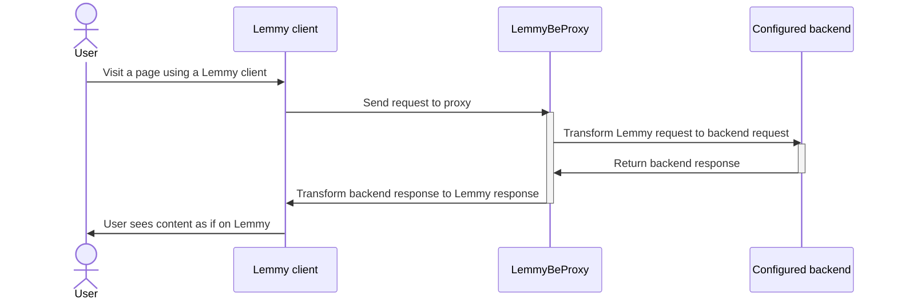

# LemmyBeProxy

A simple proxy that acts as a compatibility layer for Lemmy apps against Piefed and newer versions of Lemmy.

It sits in front of a configurable backend — a Piefed instance or a real
Lemmy instance — and speaks Lemmy's API shape to whatever's talking to
it, regardless of what's actually running on the other side. The
practical result: any frontend or app built for Lemmy (mlmym,
Alexandrite, Voyager, official Lemmy apps, and so on) can talk to this
proxy without knowing or caring what's actually behind it. This includes
older clients still built against Lemmy 0.18.x's authentication
convention, not just the `Authorization: Bearer` header used from Lemmy
0.19 onward — see Authentication compatibility below.

This proxy takes no default position on which backend you're running —
`BACKEND_TYPE` and `BACKEND_INSTANCE` are both required, with no
fallback. See Backend configuration below.

The longer-term goal is a genuine compatibility layer across Lemmy API
generations, not just across Piefed and Lemmy — letting older Lemmy
clients keep working against newer backends (including a future Lemmy
1.x), and vice versa, rather than breaking every time either side moves
forward. That work is ongoing; see Backend configuration for where it
currently stands.

Piefed's own API already overlaps with Lemmy's API in many places by
design, which is what makes Piefed support possible without
reimplementing Piefed from scratch. This project fills in the gaps:
translating field names and data shapes where they differ, handling the
places where Piefed's API diverges from Lemmy's assumptions, and covering
routes Piefed exposes under different paths or not at all natively. When
pointed at a real Lemmy backend instead, most of this translation isn't
needed at all — this proxy's internal request/response shapes are already
modeled on Lemmy's real API, so a Lemmy backend is close to a passthrough.

## How it works



The proxy exposes Lemmy's API at `/api/v3/*`, the same path a real Lemmy
server uses. Internally, each request is translated into the equivalent
call against the configured backend's own API, and the response is
translated back into the shape a Lemmy client expects. Against a real
Lemmy backend, this translation is close to a no-op, since the proxy's
internal shapes are already modeled on Lemmy's own API.

Image uploads are handled separately at `/pictrs/image`, since that is
where Lemmy clients (and real Lemmy's pict-rs image server) send them,
outside the `/api/v3` prefix. See the image upload section below for how
that works and its one real limitation.

## Authentication compatibility

Lemmy changed how clients authenticate starting in 0.19: the token moved
from an `auth` field in the request (the JSON body for POST/PUT, a query
parameter for GET) to an `Authorization: Bearer` header. This proxy
supports both. If a request arrives with no `Authorization` header, it
checks for an `auth` query parameter, then for an `auth` field in the
JSON body, and synthesizes the header Piefed (and the rest of this
proxy) expects before the request is routed anywhere.

This means older Lemmy-API clients built against the pre-0.19 convention
work through this proxy the same as current ones, with no configuration
needed on either side. The check happens once, centrally, before a
request reaches any endpoint's own logic, so it applies to every route
this proxy implements rather than needing to be handled per endpoint.
Verified against a live Piefed instance for both the query-parameter form
(`GET /user/unread_count?auth=...`) and the body-field form
(`POST /comment/like` with `"auth"` in the JSON body) — both correctly
authenticated as the same real account a header-based request would.

## Requirements

- Go 1.24 or newer to build from source
- Docker, if you would rather build and run the container image
- A running Piefed instance or a real Lemmy instance, whichever you're
  pointing this at, that you have permission to point this at
- A Lemmy-compatible frontend to actually use once the proxy is running
  (this project was built and tested against mlmym, but nothing about it
  is mlmym-specific)

## Backend configuration

This proxy takes no default position on what it's running in front of.
Two environment variables are required, with no fallback:

- `BACKEND_TYPE` — `piefed` or `lemmy`.
- `BACKEND_INSTANCE` — the hostname of that backend, for example
  `retrofed.com`. No scheme, no path.

**Current limitation, being upfront about it:** only Post and Comment
endpoints are actually backend-agnostic right now, via the
`backend.Backend` interface in `service/backend/`. Every other
controller (user, site, community, search, upload) still talks to a
Piefed-shaped client directly regardless of `BACKEND_TYPE` — that
migration is in progress, not finished. Setting `BACKEND_TYPE=lemmy`
today only changes how posts and comments behave; everything else still
assumes Piefed until the rest of the controllers get the same treatment.

**Planned, not yet implemented:** `BACKEND_TYPE` currently distinguishes
Piefed from real Lemmy, but not API generations within either — there's
no version dimension yet. The goal is for `BACKEND_TYPE` to eventually
carry a version alongside the backend choice (for example, real Lemmy
0.17.x vs 0.19.x vs a future 1.x, each of which have genuinely different
API shapes), so this proxy can act as a compatibility bridge across Lemmy
versions as well as across Piefed and Lemmy — letting an older client
keep working against a newer backend, or vice versa, instead of breaking
outright when either side moves forward. None of that version-awareness
exists yet; `BACKEND_TYPE=lemmy` today assumes a current-generation
(0.19.x-shaped) Lemmy API.

Since each running instance of this proxy only ever targets one backend,
running it against multiple backends at once (say, one Piefed instance
and one real Lemmy instance) just means running multiple containers, each
with its own `BACKEND_TYPE`/`BACKEND_INSTANCE` pair and its own port —
the same way you'd run this proxy for two different Piefed instances
today.

## Running it

### From source

1. Set the required environment variables — see Backend configuration
   above.

2. Optional environment variables:
   - `PORT`, the port the app listens on. Defaults to `8080`.
   - `SIMULATE`, whether the proxy should present itself as a Lemmy
     server when asked for version and software information.

3. Run it:
   ```
   go run main.go
   ```

### With Docker

Build the image from the included Dockerfile:

```
docker build -t lemmybeproxy .
```

Run it, publishing the port to localhost only (a reverse proxy in front of
it should handle public exposure, covered in the deployment tutorial
below):

```
docker run -d \
  --name lemmybeproxy \
  --restart unless-stopped \
  -p 127.0.0.1:8050:8080 \
  -e BACKEND_TYPE=piefed \
  -e BACKEND_INSTANCE=your-instance.example \
  lemmybeproxy
```

## Deployment tutorial

This walks through a full, real deployment: the proxy running behind a
reverse proxy, paired with mlmym as the actual frontend users visit, with
automatic image updates. This is the exact setup this project was tested
against in production, using Caddy specifically, though the same steps
apply with Nginx or any other reverse proxy.

### 1. Decide on a domain

Two options:

- Keep your Piefed domain, add path routes. This is the recommended
  approach if you do not want a separate subdomain just for the API and
  image endpoints. Add `/api/v3/*` and `/pictrs/image*` as routes on your
  existing domain that forward to the proxy container, while everything
  else continues going to Piefed as normal.

- Give your frontend its own subdomain. Your frontend (mlmym or whatever
  you are using) should live on its own subdomain regardless, since it
  renders full pages for real visitors and needs its own public HTTPS. A
  common pattern is `old.yourdomain.com` for the frontend, with the API
  and image routes from the proxy added to that same subdomain's Caddy
  block rather than your main domain. This keeps your main domain's
  behavior completely unchanged, and it means nothing on your main domain
  accidentally looks like a Lemmy server to apps or federation tooling
  that might probe it. This is the approach used in testing and the one
  described in the steps below.

Do not put the proxy's API routes on your bare Piefed domain if you can
avoid it. A Lemmy app pointed at that domain would successfully log in
and see instance metadata, then fail confusingly on almost everything
else, since only the frontend subdomain actually has the full proxy
surface behind it.

### 2. Run the proxy and the frontend

```
docker build -t lemmybeproxy .

docker run -d \
  --name lemmybeproxy \
  --restart unless-stopped \
  -p 127.0.0.1:8050:8080 \
  -e BACKEND_TYPE=piefed \
  -e BACKEND_INSTANCE=yourdomain.com \
  --label "com.centurylinklabs.watchtower.enable=true" \
  lemmybeproxy
```

Then run your frontend. This example uses mlmym:

```
docker run -d \
  --name mlmym \
  --restart unless-stopped \
  -p 127.0.0.1:8051:8080 \
  -e LEMMY_DOMAIN=old.yourdomain.com \
  --add-host old.yourdomain.com:host-gateway \
  --label "com.centurylinklabs.watchtower.enable=true" \
  code.mschae23.de/mschae23/mlmym:latest
```

Two details worth explaining:

`LEMMY_DOMAIN` should be set to the frontend's own public subdomain, not
to the proxy's internal port and not to your Piefed domain. mlmym uses
this value both to build links and to make its own outbound API calls,
so it needs to be a real, publicly resolvable hostname that Caddy will
route correctly.

`--add-host old.yourdomain.com:host-gateway` matters more than it looks.
Without it, the frontend container reaches its own API calls by going
out to the public internet and back in again, since it is calling its
own public domain name. That round trip through your firewall and back
is genuinely slow and adds latency to every single page load. This flag
makes the container resolve that domain straight to the host machine
instead, so the connection never actually leaves the server. Caddy still
sees the same hostname and routes it the same way, so nothing about the
routing logic changes, only the network path gets shorter.

### 3. Configure your reverse proxy

Whatever reverse proxy sits in front of your frontend subdomain, the
requirement is the same: send `/api/v3/*` and `/pictrs/image*` to the
proxy container, and send everything else to the frontend container.
Piefed's own documentation recommends Nginx, so that is likely what you
already have running, but the same idea applies to Caddy, Traefik, or
anything else. Examples for both Nginx and Caddy are below.

#### Nginx

Add this to the server block for your frontend subdomain, above the
existing `location /` block that proxies to the frontend, since Nginx
matches locations by specificity and these need to take priority:

```
location /api/v3/ {
        proxy_pass http://127.0.0.1:8050;
        proxy_set_header Host $host;
        proxy_set_header X-Real-IP $remote_addr;
        proxy_set_header X-Forwarded-Proto https;
}

location /pictrs/image {
        proxy_pass http://127.0.0.1:8050;
        proxy_set_header Host $host;
        proxy_set_header X-Real-IP $remote_addr;
        proxy_set_header X-Forwarded-Proto https;
}

location / {
        proxy_pass http://127.0.0.1:8051;
        proxy_set_header Host $host;
        proxy_set_header X-Real-IP $remote_addr;
        proxy_set_header X-Forwarded-Proto https;
}
```

Adjust the ports to match however you published the containers. Test
the configuration before reloading:

```
nginx -t
```

If that reports the configuration is valid, reload:

```
systemctl reload nginx
```

#### Caddy

Add this to your frontend subdomain's block, using `handle` so these
routes take priority over the frontend's own catch-all reverse proxy:

```
old.yourdomain.com {
        handle /api/v3/* {
                reverse_proxy localhost:8050 {
                        header_up Host {host}
                        header_up X-Real-IP {remote_host}
                        header_up X-Forwarded-Proto https
                }
        }
        handle /pictrs/image* {
                reverse_proxy localhost:8050 {
                        header_up Host {host}
                        header_up X-Real-IP {remote_host}
                        header_up X-Forwarded-Proto https
                }
        }
        reverse_proxy localhost:8051 {
                header_up Host {host}
                header_up X-Real-IP {remote_host}
                header_up X-Forwarded-Proto https
        }
}
```

Adjust the ports if you published the containers differently. Validate
before reloading:

```
caddy validate --config /etc/caddy/Caddyfile
```

If that reports a valid configuration, reload:

```
systemctl reload caddy
```

If your reverse proxy runs inside Docker rather than as a host service,
reload it through its container instead, for example `docker exec
<container> caddy reload --config /etc/caddy/Caddyfile` or `docker exec
<container> nginx -s reload`.

### 4. Verify it

```
curl -s "https://old.yourdomain.com/api/v3/site" | head -c 200
```

This should return real site data from your Piefed instance, translated
into Lemmy's response shape. If it does, load the frontend's URL in a
browser and confirm it renders.

### 5. Set up automatic updates (optional but recommended)

Both containers above are labeled for Watchtower. If you do not already
run Watchtower on this host:

```
docker run -d \
  --name watchtower \
  --restart unless-stopped \
  -e DOCKER_API_VERSION=<your docker daemon's api version> \
  -v /var/run/docker.sock:/var/run/docker.sock \
  containrrr/watchtower \
  --label-enable --cleanup --interval 86400
```

Find your daemon's API version with `docker version --format
'{{.Server.APIVersion}}'`. Setting it explicitly avoids a real
compatibility issue in some Watchtower builds, where the bundled Docker
client defaults to an old API version and refuses to talk to a newer
daemon.

With `--label-enable`, Watchtower only touches containers carrying its
label, so it will not affect anything else running on the host.

## Environment variables

Proxy:

| Variable | Required | Description |
|---|---|---|
| `BACKEND_TYPE` | Yes | `piefed` or `lemmy` — which backend this proxy is translating to. No default. |
| `BACKEND_INSTANCE` | Yes | Hostname of the backend to translate requests to. No scheme, no trailing slash. |
| `PORT` | No | Port to listen on. Defaults to `8080`. |
| `SIMULATE` | No | If set, the proxy presents itself as a Lemmy server when asked for version and software information. |

mlmym (or whatever Lemmy frontend you run alongside the proxy) has its
own environment variables, including `LEMMY_DOMAIN`, `COLLAPSE_MEDIA`,
and `HIDE_THUMBNAILS`. Refer to that project's own documentation for the
full list.

## Endpoint status

### Implemented and tested against a live Piefed instance

- `POST /user/login`
- `GET /user/unread_count`
- `GET /site`
- `GET /post/list`
- `GET /post`
- `POST /post` (create post)
- `PUT /post` (edit post)
- `POST /post/like` (voting)
- `POST /post/mark_as_read`
- `GET /comment/list`
- `GET /comment`
- `POST /comment`
- `GET /community`
- `GET /community/list`
- `POST /community/follow` (join or leave a community)
- `GET /search`
- `GET /user` (the optional `site` field on this response is not
  populated, since it requires the same ActivityPub actor fetch that
  `GET /site` uses, and that has not been wired in here)
- `POST /user/block`
- `POST /community/block`
- `POST /pictrs/image` (image upload, deliberately outside `/api/v3`,
  since that is where Lemmy clients and real Lemmy's pict-rs actually
  send uploads)
- `GET /pictrs/image/{token}` (serves uploaded images by redirecting to
  Piefed's real file, see the limitation noted below)
- `POST /comment/like` (voting) — verified against a live instance with a
  real account: score incremented correctly, `my_vote` reflected the
  vote, and repeating the same vote correctly toggled it back off
  (Piefed's own undo behavior, not a bug)
- `PUT /user/save_user_settings` — verified against a live instance: of
  the full field set Lemmy clients send, only four have a real Piefed
  equivalent (`show_nsfw`, `default_sort_type`, `default_comment_sort_type`,
  `show_read_posts`) and are forwarded; the rest are accepted so the save
  does not fail outright, then silently dropped, see the limitation noted
  below

### Known gaps, not implemented

These are not translation failures. Piefed's own API has no working
implementation behind these routes either, confirmed directly from
Piefed's source: each one hits a stub that always returns
`not_yet_implemented`, or in the case of report count, is explicitly
marked in Piefed's own code as a future addition that does not exist
yet. There is nothing on Piefed's side for this proxy to translate to.

- Registration
- Report count
- Password reset and password change
- TOTP
- Account deletion
- Email verification
- Admin tools
- Custom emoji

### Known limitation: image thumbnails

`/pictrs/image/{token}` redirects to Piefed's original, full resolution
image rather than resizing it. Lemmy clients request thumbnails using
query parameters such as `?format=jpg&thumbnail=96`, which only mean
something to a real pict-rs server. Piefed does not understand them, so
they are silently ignored. Images work correctly, but always load at
full resolution rather than as a small thumbnail. If a page has many
images, this can meaningfully increase load time and memory use on the
client, particularly on mobile browsers. Reducing image weight with your
frontend's own settings, such as mlmym's `COLLAPSE_MEDIA`, is a
reasonable mitigation until this project implements real server side
thumbnail generation, which it currently does not.

### Known limitation: unsupported user settings fields are silently dropped

Lemmy's `save_user_settings` accepts a much larger set of fields than
Piefed's own equivalent endpoint actually supports (confirmed directly
from Piefed's schema, which notes in its own source: "not all settings
implemented yet, nor all choices for settings"). Rather than reject a
save outright because it contains a field Piefed cannot store, this
proxy accepts the full Lemmy-shaped request, forwards only the fields
Piefed genuinely supports, and quietly drops the rest.

This was a deliberate choice, not an oversight: before this existed,
saving *any* setting through a Lemmy client failed outright, since this
endpoint was not implemented at all, and every save request errored.
Treating unsupported fields as no-ops instead of hard failures means the
fields Piefed does support (NSFW visibility, default sort, comment sort,
show read posts) now save correctly, at the cost of the unsupported ones
silently not persisting.

One field is worth calling out specifically: mlmym's "endless scrolling"
setting has no Piefed equivalent at all, so it can never be saved
server-side through this proxy. Because of how mlmym's own frontend
works, this shows up as a purely cosmetic issue rather than a functional
one: the checkbox's visual state is driven by a server-side value that
can get stuck, but the actual behavior (whether scrolling triggers more
requests) is controlled separately by the browser's own local storage,
which does update correctly on save. The setting behaves as intended;
only the checkbox's displayed state can be stale after a reload.

## Troubleshooting

A few real issues that came up during development and deployment, kept
here since they are easy to hit again and not always obvious from the
error alone.

Response bodies fail to parse with an error mentioning an invalid
character around byte 0x1f. That byte is the start of a gzip file
header. This means a response came back gzip compressed but was handed
to the JSON parser as raw bytes instead of being decompressed first. Go's
HTTP client normally handles this automatically, but only if the request
does not already have an explicit `Accept-Encoding` header set. If a
client's own `Accept-Encoding` header gets forwarded onto the proxy's
outbound request to Piefed, Go's automatic handling is disabled. This
project strips that header before forwarding for exactly this reason. If
you fork this and add new outbound requests elsewhere, keep that in
mind.

The frontend is slow on every page load in a way that does not match how
fast the API responds on its own when tested directly. Check whether the
frontend container is reaching its own API calls by going out to the
public internet and back in, rather than staying on the local network.
This happens when a container's own domain resolves to its real public
IP address instead of back to the host machine. Adding `--add-host
yourdomain.com:host-gateway` when running the frontend container fixes
this, as described in the deployment tutorial above.

A specific sort or listing combination reliably fails or is much slower
than others. Piefed validates sort values per endpoint, and the valid
set is not the same for every endpoint. Community listing in particular
accepts a smaller set of sort values than post listing does. A sort
value that is completely valid for posts can be rejected outright for
community listing. If you see a validation error mentioning an
unexpected sort value, check what Piefed's own error message says is
actually valid for that specific endpoint rather than assuming it
matches another endpoint's accepted values.

Go build fails with a message about the `slices` package not being in
GOROOT. This means an old Go toolchain is active, most likely one
installed through a distribution's package manager rather than the
official Go binary. Check `go version`. This project needs Go 1.24 or
newer. Installing the official binary from the Go website and putting it
first in your `PATH` resolves this.

## Contributing

This project translates between two APIs that are similar but not
identical, and the gaps between them are usually only discoverable by
testing against a real Piefed instance and comparing the real response
shapes and validation rules to what the code assumes. If you add a new
endpoint, testing it against a live instance rather than only reading
Piefed's schema source is worth the extra step, since this project's own
history includes real cases where Piefed's schema definitions did not
match what its API actually validated at runtime.
