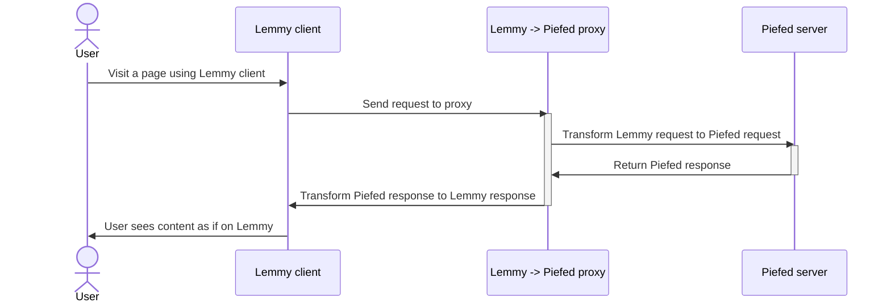

> More comprehensive README is coming later

## Getting it to run:

1. Define env variables
   - `PIEFED_INSTANCE` - the hostname of the Piefed instance this proxy uses
   - `PORT` (optional)—the port the app runs on, defaults to 8080
   - `SIMULATE` (optional)—whether the Proxy should pretend it's a Lemmy server (when returning version, software etc.)

2. Run
   - `go run main.go`

### Docker

You can build a production ready Docker image from the [Dockerfile](Dockerfile) by running:

`docker build -t lemmy-piefed-proxy .`

## Flow

## Endpoint status

### Implemented and tested against a live Piefed instance
- `POST /user/login`
- `GET /user/unread_count`
- `GET /site`
- `GET /post/list`
- `GET /post`
- `POST /post/like` (voting)
- `GET /comment/list`
- `GET /comment`
- `POST /comment`
- `GET /community`
- `GET /community/list`
- `GET /search`

### Implemented but not yet verified against a live instance
- `POST /comment/like` (voting) — same pattern as `/post/like`, which is confirmed working, but not independently tested

### Known gaps — not implemented
- Image upload
- Mark post as read
- User/person profile pages
- Community subscribe / unsubscribe
- User or content blocking
- Registration (returns an error page — Piefed's registration flow can't be mapped to Lemmy's)
- Report count (returns an error page — same reason)
